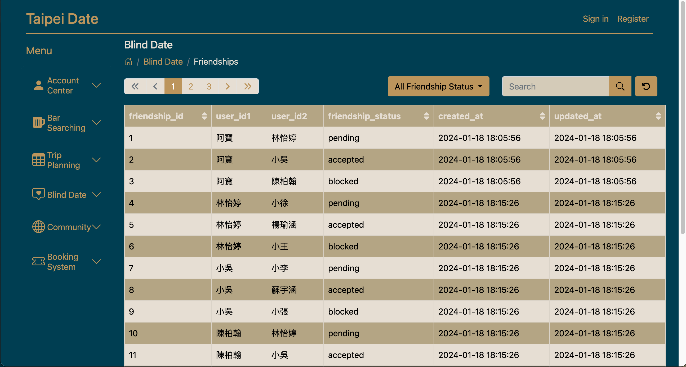
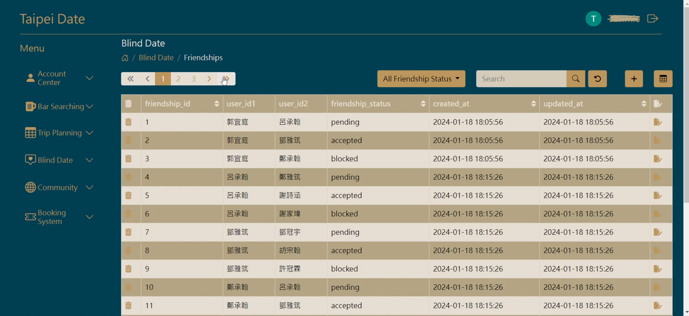
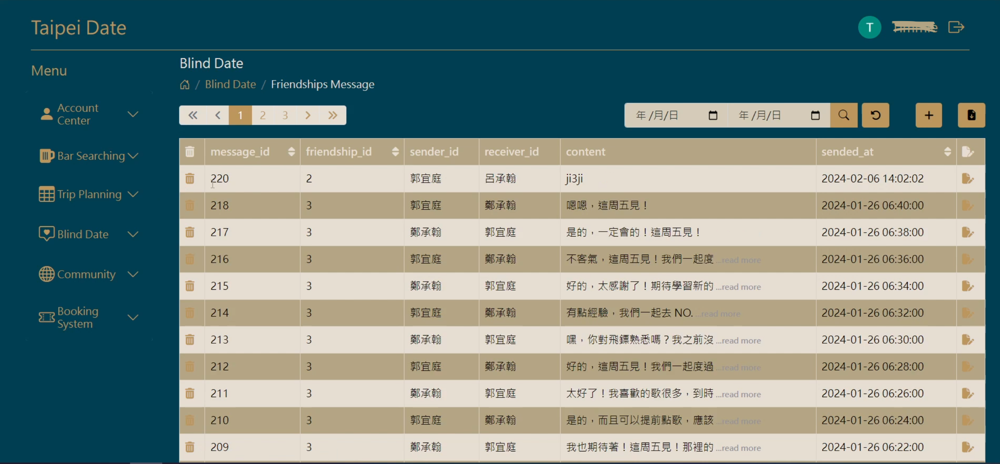
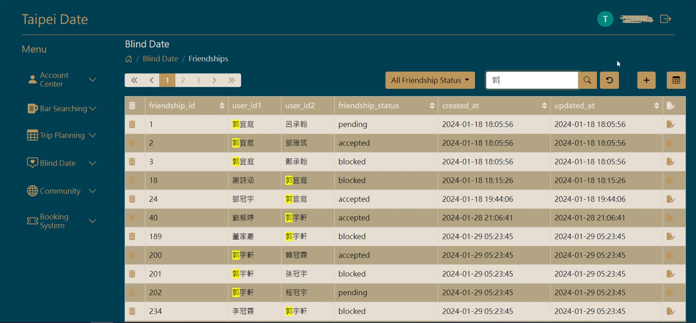
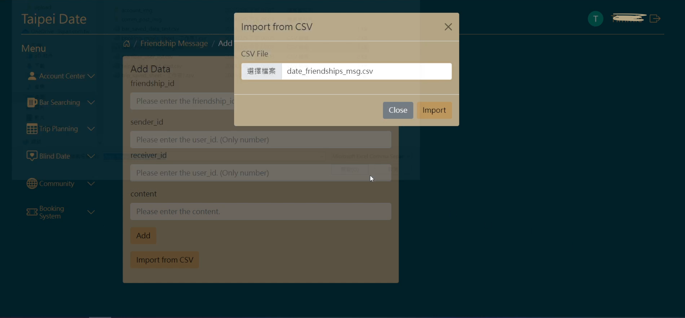
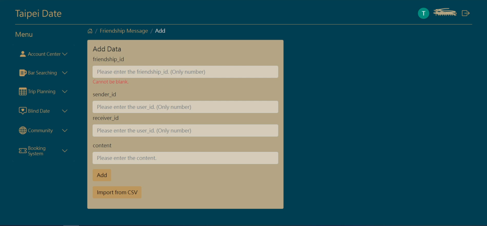
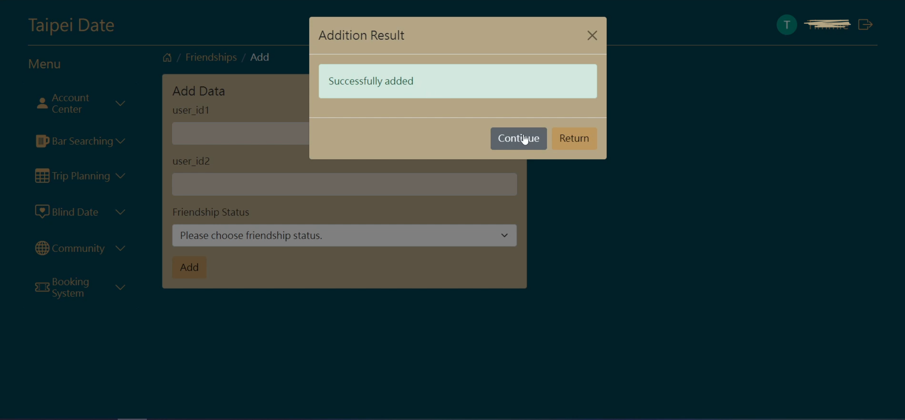

# Backend management system

## 📋 Description

This Repo is a course practice topic. (iSpan front-end engineer development class, mid-term special topic.)

The course topic is Taipei Date, which focuses on matching and making friends, supplemented by social software and itinerary planning.

The function I am mainly responsible for is Blind Date.

Use XAMPP,PHP,MySQL technology to complete the establishment of the backend management system.

## 🔍 Function

There are login and non-login functions.

When not logged in, you cannot do any editing, you can only view.

When you are logged in, you can do editing operations.

- Create (There will be field checking when adding)
- Read (Keyword search, drop-down menu search, date filtering and sorting functions)
- Update (A confirmation window will pop up when the update is successful or failed)
- Delete (Can be deleted when logging in)

## 🛠️ Technologies & Requirements

- XAMPP
- PHP
- MySQL

## 💻 Demo Screenshot

(Attached is a simple demo)

## 🚀 Getting Started

1. Download and install XAMPP.

2. Click on Manage Serves to enable Apache and Mysql services.

3. Open the database backend.

4. Use taipei_date.sql to create a new database.

5. Download ZIP and place the file in Applications >> XAMPP\htdocs

6. Go to "http://localhost/${yourfoldername}"

## 👤 Author

Email:yiting536@gmail.com

## ⭕️ Warning

This is purely for practice and not for any profit-making purpose.Thanks!

## ⛔️ Notice

For security reasons, remove security-related content, such as the location of Google OAuth Client ID and Client Secret.

Therefore, some content may not be available for normal use.
